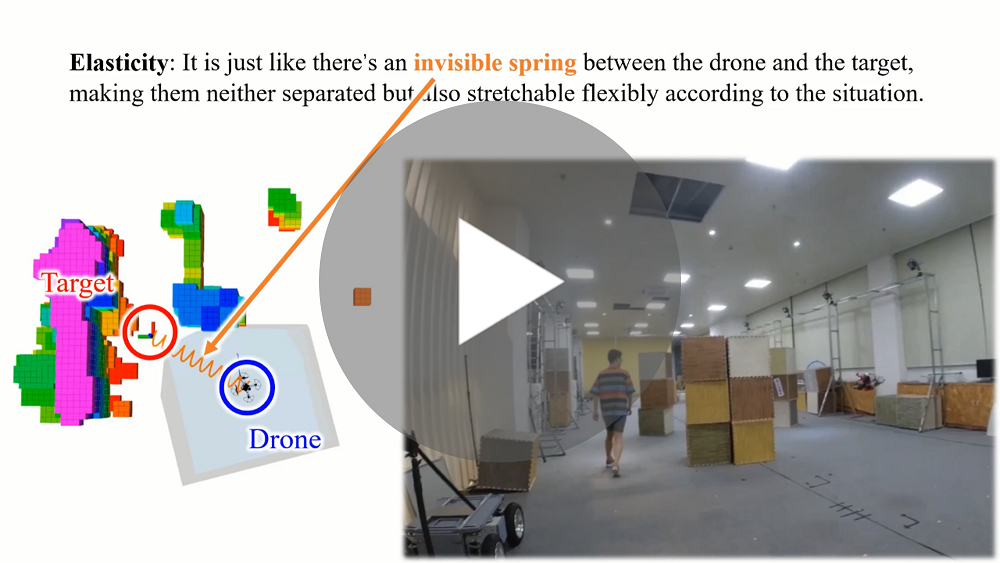
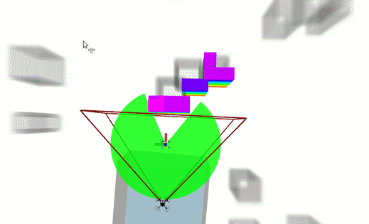
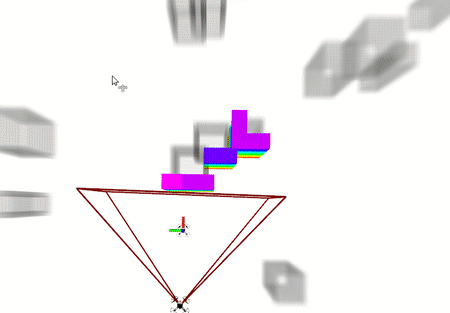
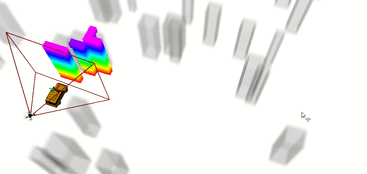

# Elastic-Tracker

## 0. Overview
**Elastic-Tracker** is a flexible trajectory planning framework that can deal with challenging tracking tasks with guaranteed safety and visibility.

**Authors**: Jialin Ji, Neng Pan and [Fei Gao](https://ustfei.com/) from the [ZJU Fast Lab](http://zju-fast.com/). 

**Paper**: [Elastic Tracker: A Spatio-temporal Trajectory Planner Flexible Aerial Tracking](https://arxiv.org/abs/2109.07111), Jialin Ji, Neng Pan, Chao Xu, Fei Gao, Accepted in IEEE International Conference on Robotics and Automation (__ICRA 2022__).

**Video Links**: [youtube](https://www.youtube.com/watch?v=G5taHOpAZj8) or [bilibili](https://www.bilibili.com/video/BV1o44y1b7wC)
<a href="https://www.youtube.com/watch?v=G5taHOpAZj8" target="blank">
  <p align="center">
    
  </p>
</a>

## 1. Simulation of Aerial Tracking 

[NOTE] remember to change the CUDA option of **src/uav_simulator/local_sensing/CMakeLists.txt**

>Preparation and visualization:
```
git clone https://github.com/Yuxin-Wei/Elastic-Tracker.git
cd Elastic-Tracker
catkin_make
source devel/setup.zsh
chmod +x sh_utils/pub_triger.sh
roslaunch mapping rviz_sim.launch
```

>A small drone with the global map as the chasing target:
```
roslaunch planning fake_target.launch
```

>Start the elastic tracker:
```
roslaunch planning simulation1.launch
```

>Triger the drone to track the target:
```
./sh_utils/pub_triger.sh
```
<p align="center">
    
</p>

### Differentiable ray-transmittance visibility

The trajectory optimizer supports a differentiable visibility cost computed directly from the inflated occupancy map. Occupancy is trilinearly interpolated at voxel centers, attenuation is integrated at a fixed number of midpoint samples along the UAV-target ray, and the resulting optical depth defines transmittance as `T = exp(-tau)`. A cubic penalty is active when `T < T_safe`.

This change is limited to the visibility evaluator in the trajectory optimizer. The A*/`findVisiblePath` frontend, visible-region generation, safe-flight-corridor construction, MINCO representation and gradient transmission, target predictor, and all other trajectory costs remain unchanged.

The following parameters are defined in `src/planning/planning/launch/planning.launch`:

| Parameter | Default | Description |
| --- | ---: | --- |
| `visibility/model` | `ray` | Visibility evaluator: `legacy`, `ray`, or `none` |
| `visibility/rho` | `10000.0` | Ray-visibility penalty weight |
| `visibility/ray_samples` | `20` | Fixed midpoint samples per ray |
| `visibility/T_safe` | `0.80` | Minimum acceptable transmittance |
| `visibility/occ_max_prob` | `0.95` | Maximum occupied-voxel probability; must be below 1 |
| `visibility/unknown_prob` | `0.0` | Occupancy proxy assigned to unknown voxels |
| `visibility/eps` | `1e-6` | Numerical regularization for attenuation |
| `visibility/debug` | `false` | Enable throttled optical-depth diagnostics |
| `visibility/visualize` | `true` | Publish ray diagnostics for RViz |

`rviz_sim.launch` loads displays for `/drone0/planning/ray_visibility` and `/drone1/planning/ray_visibility`. Green rays satisfy `T_safe`; red/orange rays violate it; arrows show the visibility-cost descent direction. The marker `diagnostics` namespace can be enabled in RViz to show `tau`, `T`, cost, and `|grad_tau|`.

Run the numerical validation with:

```bash
catkin_make run_tests_traj_opt
```

The tests cover free and blocked LOS, short rays, unknown occupancy, obstacle boundaries, randomized boundary-near positions, and a bidirectional LOS sweep. The sweep verifies monotonically decreasing transmittance toward occlusion, a nonzero lateral descent direction toward clearance, and analytical gradients against central finite differences away from interpolation boundaries.

Comparison of the planner using the *legacy angular visibility cost* and the *ray-transmittance visibility cost*:
```
roslaunch planning simulation2.launch
```

`drone0` uses `visibility/model=legacy`; `drone1` uses `visibility/model=ray`.

<p align="center">
    
</p>

## 2. Simulation of Aerial Landing

> First start the stage of tracking:
```
roslaunch planning fake_car_target.launch
roslaunch planning simulation_landing.launch
./sh_utils/pub_triger.sh
```
> Triger the drone to land on the moving vehicle:
```
./sh_utils/land_triger.sh
```
<p align="center">
    
</p>

## 3. Acknowledgement
We use [**MINCO**](https://github.com/ZJU-FAST-Lab/GCOPTER) as our trajectory representation.

We use [**DecompROS**](https://github.com/sikang/DecompROS) for safe flight corridor generation and visualization.
